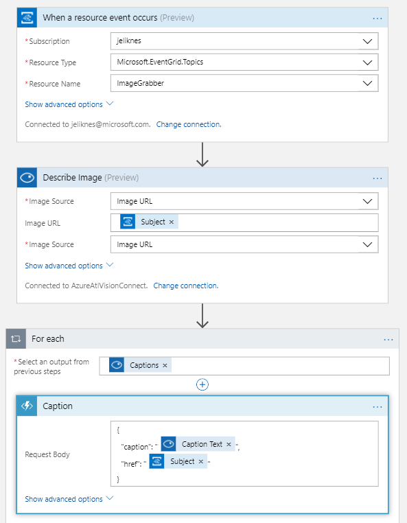

# Event-Grid-Glue

Example Event Grid Application

This is an example application that will leverage a custom message to retrieve
an image, copy it to blob storage and invoke the vision API to caption it. 

To work, you must take a few steps: 

1. Create a custom Event topic you use to publish the message to
2. Create a cognitive services Vision API endpoint 
3. Build a logic app to receive events and update the captions

The logic app looks like this:

